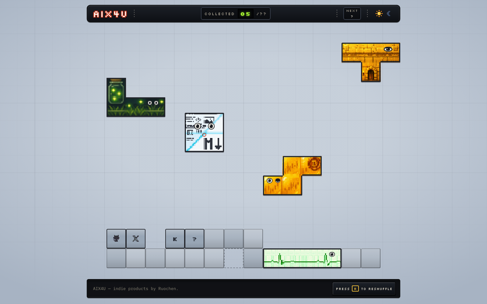

# aix4u.com

**A product portfolio rendered as a frozen frame of an ongoing Tetris game.** Every product I ship is a tetromino: it drops in, lands somewhere on the board, and stays there.

Live at **[aix4u.com](https://aix4u.com)**.



Astro, TypeScript, no UI framework, no analytics, no third-party requests. One page, ~1 MB of static output.

---

## The concept

**A product is a tetromino.** Each shape is chosen for meaning, not variety — L is a jar standing in a meadow, S is a wave, I is a paper strip, O is a folded page, T is a doorway. The engine never rotates a piece, because the orientation *is* the identity. The skin carries the product; there are no label cards and no name text on the piece itself. Every word about a product lives in the bezel at the bottom, which types out the selected line.

**One seed, one scene.** A single integer through a mulberry32 PRNG decides lane order, floating heights, the shape of the stack, where the holes are, and the ghost piece's path. The scene builder is pure and isomorphic: it runs at **build time** with a fixed seed, so `dist/index.html` ships a complete, clickable page that works with JavaScript off — and in the **browser** with a random seed, which only *moves* elements that already exist. Press <kbd>R</kbd> to hard-drop the sky and reshuffle; `?seed=12345` reproduces any scene exactly.

**The board is mostly empty on purpose.** A wall of tiles reads as a shelf, not a game. High-priority products float in the sky, one per lane; everything else rests in a low bed along the floor that always keeps a hole or two, because that is the only kind of hole a real game leaves.

**There is one easter egg.** It is a keyboard sequence every player of a certain age already knows, it fires once per session, and it is pure spectacle. That is all you get.

## Adding a product

Append one object to `items` in [`src/data/products.json`](src/data/products.json):

```json
{
  "type": "product",
  "id": "new-thing",
  "name": "New Thing",
  "shape": "T",
  "accent": "#c46bd8",
  "accentDark": "#e08bf5",
  "priority": 6,
  "url": "https://newthing.example",
  "kind": "WEB",
  "status": "BETA",
  "tagline": "One line, read out by the info panel",
  "description": "A sentence or two, used in the JSON-LD ItemList.",
  "iconAt": [1, 1],
  "face": { "preset": "keeper", "at": [2, 0, 0.38, 0.34] },
  "motion": "tease-rotate",
  "skin": { "light": "/skins/new-thing-light.webp", "dark": "/skins/new-thing-dark.webp" }
}
```

That is the whole wiring change. The HUD counter, the info panel line, the lane or bed placement, the sitemap and the `ItemList` structured data are all derived from it. Validation lives in `src/lib/content.ts` and runs during the build, so a bad hex, an out-of-bounds face anchor or a duplicate priority fails `npm run build` rather than production.

Field-by-field rules, the shape/skin/copy decision process and the asset brief are in **[docs/adding-a-product.md](docs/adding-a-product.md)**.

## Development

```sh
npm install
npm run dev      # http://localhost:4321
npm run build    # the full chain, into dist/
npm run preview  # serve the built dist/
```

`npm run build` is four steps, in order, and any one of them failing fails the build:

| Step | What it guarantees |
|---|---|
| `astro check` | types and template diagnostics, zero tolerance |
| `npm run check:scene` | replays the scene engine over 3 200 scenes (8 viewport widths × 400 seeds) plus every piece's identity geometry: no overlaps, nothing resting where it should be suspended, the stack reads as a bed rather than a pile, every hole covered and bridged, no face mark or icon badge straying outside its own piece |
| `astro build` | the static output in `dist/` |
| `npm run check:links` | re-reads the *built* HTML: every off-site anchor has `target="_blank"` and both halves of `rel="noopener noreferrer"`, carries `?ref=aix4u`, has an `aria-label` of `Name — tagline`, and nothing on the page carries a `title` attribute |

Also available: `npm run check` (types only) and `npm run sync-fonts` (re-copies the woff2 subsets out of the `@fontsource/*` packages into `public/fonts/`, needed only after bumping those).

While working on the engine: `?seed=` reproduces a scene, `?theme=light|dark` forces a theme for one load without persisting it, <kbd>R</kbd> reshuffles. Run `check:scene` after touching `src/lib/scene.ts`, `src/lib/tetromino.ts` or any piece's `face` / `iconAt`.

## Layout

```
src/data/products.json   the CMS — five products, three link tiles, one NEXT teaser
src/lib/content.ts       build-time validation
src/lib/tetromino.ts     shape geometry in grid cells
src/lib/scene.ts         the scene engine (pure, isomorphic)
src/components/          HUD, playfield, piece (skin + face), bottom bezel
src/scripts/main.ts      client entry: theme, seed lifecycle, reshuffle, panel, pointer
src/styles/global.css    the whole visual language, themed with custom properties
scripts/check-scene.ts   layout invariants over thousands of seeds
scripts/check-links.ts   post-build assertions on the shipped HTML
docs/DESIGN.md           the source of truth for every visual decision
```

[`docs/DESIGN.md`](docs/DESIGN.md) is where the design lives — concept, palette, scene model, animation budget, responsiveness, and a running log of what was tried and reverted. Changes to the design go through that document first.

## Deploying (Cloudflare Pages)

A plain static bundle; Pages builds it on push.

| Setting | Value |
|---|---|
| Framework preset | Astro (or None) |
| Build command | `npm run build` |
| Build output directory | `dist` |
| Node version | 20 or newer (`NODE_VERSION` environment variable) |

No environment variables, no functions, no CI configuration — deliberately. If you fork this, set `site` in `astro.config.mjs` to your own domain.

## Built with

[Astro](https://astro.build) · TypeScript · vanilla DOM · [Silkscreen](https://fonts.google.com/specimen/Silkscreen) and [IBM Plex Mono](https://fonts.google.com/specimen/IBM+Plex+Mono), self-hosted as latin subsets.

## License

[MIT](LICENSE) © 2026 Ruochen Lyu.

The artwork in `public/skins` and `public/icons` is not covered by the MIT license — the piece skins, icons and OG image are brand assets and all rights to them are reserved. Everything else, take it.

---

<details>
<summary><b>中文</b></summary>

## aix4u.com

**一个渲染成"俄罗斯方块进行中的定格画面"的产品作品集。** 我发布的每个产品都是一块骨牌：掉进来、落在盘面某处、留在那里。

线上地址：**[aix4u.com](https://aix4u.com)**。

Astro + TypeScript，零 UI 框架、零统计、零第三方请求。单页，静态产物约 1 MB。

### 概念

**产品即骨牌。** 形状是为语义选的，不是为多样性：L 是立在草地上的罐子，S 是一道波浪，I 是纸带，O 是对折的页面，T 是一道门。引擎从不旋转骨牌——朝向本身就是身份的一部分。皮肤承载产品身份，骨牌上没有标签卡也没有名字文字；关于产品的每一个词都活在底部那条信息带里，由它逐字打出来。

**一个种子，一个场景。** 一个整数经 mulberry32 伪随机数生成器决定：泳道顺序、悬浮高度、底堆的形状、洞在哪里、幽灵骨牌的路径。场景构建函数是纯函数且同构：**构建时**用固定种子跑一次，所以 `dist/index.html` 出厂就是一张完整可点的页面，关掉 JavaScript 也能用；**浏览器里**用随机种子再跑一次，只是*移动*已经存在的元素。按 <kbd>R</kbd> 让天空硬降并重排；`?seed=12345` 可以精确复现任何一个场景。

**盘面大面积留空是故意的。** 铺满骨牌读起来像货架，不像游戏。高优先级产品悬在天上，一条泳道一个；其余的落在贴地的矮床里，那张床永远留着一两个洞——因为真实的对局只会留下这种洞。

**有一个彩蛋。** 是一串到了某个年纪的人都认得的键盘序列，每个会话只触发一次，纯粹是场面。就说到这里。

### 新增产品

在 [`src/data/products.json`](src/data/products.json) 的 `items` 里追加一条对象（字段示例见上方英文段）。这就是全部接线改动：HUD 计数、信息面板文案、泳道或底床落点、sitemap、JSON-LD `ItemList` 全部由这条 JSON 派生。校验写在 `src/lib/content.ts` 里并在构建期运行，坏 hex、越界的脸部锚点、重复的 priority 会让 `npm run build` 直接失败，而不是让线上失败。

逐字段规则、形状/皮肤/文案的决策流程、以及出图任务书在 **[docs/adding-a-product.md](docs/adding-a-product.md)**。

### 开发

```sh
npm install
npm run dev      # http://localhost:4321
npm run build    # 完整链路，产出到 dist/
npm run preview  # 起本地服务看构建产物
```

`npm run build` 是四步顺序执行，任一步失败即构建失败：`astro check`（类型与模板诊断，零容忍）→ `check:scene`（在 3 200 个场景上重放场景引擎：8 种视口宽度 × 400 个种子，断言无重叠、该悬空的不落地、底堆读作床而非堆、每个洞都被盖住并搭桥、脸部标记与图标不越出自身骨牌）→ `astro build` → `check:links`（重读*构建后*的 HTML：外链齐备 `target="_blank"` 与 `rel="noopener noreferrer"` 两半、带 `?ref=aix4u`、`aria-label` 形如 `Name — tagline`，且页面上不存在任何 `title` 属性）。

另有 `npm run check`（只跑类型）和 `npm run sync-fonts`（把 woff2 子集从 `@fontsource/*` 重新拷进 `public/fonts/`，只在升级这两个依赖后需要）。

调引擎时：`?seed=` 复现场景，`?theme=light|dark` 强制单次加载的主题且不持久化，<kbd>R</kbd> 重排。改过 `src/lib/scene.ts`、`src/lib/tetromino.ts` 或任何骨牌的 `face` / `iconAt` 之后，跑一遍 `check:scene`。

### 部署（Cloudflare Pages）

纯静态包，Pages 在 push 时构建：构建命令 `npm run build`，输出目录 `dist`，Node 20 或更高（`NODE_VERSION` 环境变量），框架预设 Astro 或 None。没有环境变量、没有 Functions、没有 CI 配置——这是故意的。fork 的话记得把 `astro.config.mjs` 里的 `site` 改成你自己的域名。

设计决策的唯一来源是 [`docs/DESIGN.md`](docs/DESIGN.md)——概念、配色、场景模型、动画预算、响应式，以及一份"试过什么、又推翻了什么"的记录。改设计先过那份文档。

### 许可

代码 [MIT](LICENSE) © 2026 Ruochen Lyu。

`public/skins` 与 `public/icons` 下的美术资产**不在 MIT 许可范围内**——骨牌皮肤、图标和 OG 图是品牌资产，保留所有权利。其余部分随意取用。

</details>
