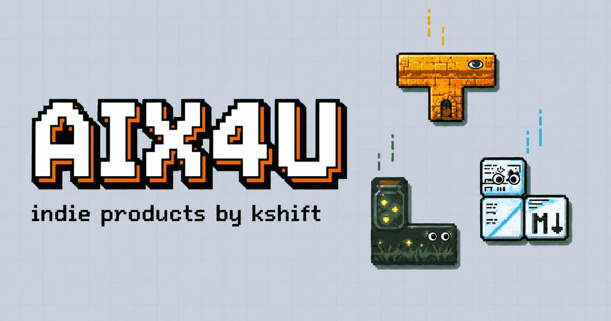

# aix4u.com

The homepage of [aix4u.com](https://aix4u.com), built as a **frozen frame of an ongoing
Tetris game**. Every product I ship is a tetromino: it drops in, lands somewhere on the
board, and stays there. The page is mostly empty grid on purpose — the breathing room is
the point, and a wall of tiles would read as a shelf, not a game.

Astro, TypeScript, zero UI framework. One vanilla module positions the scene; everything
it positions already exists in the static HTML.



<!-- TODO: replace with a real screenshot once the pixel icons land (see "Assets"). -->

## How it works

```
src/data/products.json   the CMS — five products, three link tiles, one NEXT teaser
src/lib/content.ts       build-time validation; a bad entry fails the build
src/lib/tetromino.ts     shape geometry in grid cells
src/lib/scene.ts         the scene engine (pure, isomorphic)
src/components/          HUD, playfield, piece (skin + face), bottom bezel (info panel + key legend)
src/scripts/main.ts      client entry: theme, seed lifecycle, reshuffle, panel, pointer tracking
src/styles/global.css    the whole visual language, themed with custom properties
scripts/check-scene.ts   layout invariants, checked over thousands of seeds
```

**One seed, one scene.** A single integer runs through a mulberry32 PRNG and determines
lane order, floating heights, the shape of the stack, where the holes are, and the ghost
piece's path. `buildScene()` is pure and runs in both Node and the browser:

- at **build time** with a fixed seed, so `dist/index.html` ships a complete, readable,
  clickable scene — with JavaScript off the page still works;
- in the **browser** with a random seed (or `?seed=` from the URL), which only *moves*
  the elements that are already there. Pieces are real `<a href>` elements at every stage.

**Two pools.** High-priority products float in the sky, one per vertical lane, spread over
the upper two thirds of the field. Everything else — lower-priority products and the link
tiles — rests on the stack at the bottom, which occupies a seed-placed window of the floor,
is a low bed: it spans ~85 % of the floor, runs one or two rows deep with at most one bump,
carries the link tiles perched on top like collectibles, and always keeps a hole or two —
covered from above and bridged from the side, because that is the only kind of hole a real
game leaves. The lane count comes from the viewport, so on a narrow screen the low-priority
pieces spill down into the stack instead of crowding the sky. Ship more products and the
stack gets taller and prouder.

**A piece carries its own identity.** There are no label cards, no popovers and — since
v2.1 — no name text on the piece either: the skin *is* the identity, and every word about a
product lives in the one bottom bezel, which types the selected product's line out. The name
and tagline still ship in each piece's own link as screen-reader text, so a crawler and a
no-JS visitor read the whole page. Each shape has a single canonical orientation — the engine
never rotates one, because the orientation is part of the meaning (L is a jar over a meadow,
S is a wave, I is a strip, O is a page, T is a doorway) — and the face and the icon badge are
designed against that one silhouette. Each piece wears a **face preset** derived from how it
falls: the T is a half-lidded keeper, the L two close-set dots that glance at their own jar, the
S one open eye and one squinting, the O two big eyes and a tiny "o" mouth, the I one calm eye
that blinks on the same beat it floats to. Shared across all five: pupils step towards the
pointer, blinks run on seeded phases, 30 seconds of nothing puts every face to sleep, a landing
screws them shut, and hovering bows them into a ∪.

`npm run check:scene` asserts the layout invariants over 3 200 scenes (eight viewport
widths × four hundred seeds) plus every piece's identity geometry, and runs as part of
every build: no two pieces overlap, nothing sits on the stack that should be floating,
a suspended piece keeps air under it, the stack reads as a bed rather than a pile, every
hole is covered and bridged, and no face mark or badge strays outside its own piece's cells.

**Every block is a key.** One extrusion model for the whole page: a piece, a link tile and a
button all sit on a solid side face in their own colour taken down 35 %, with a single tight
contact line under it. Hover lifts the body off its side and the side grows to meet the
ground; pressing sinks it back in. There are no stacked drop shadows anywhere — two offset
copies of a shape read as paper, not as thickness.

**Motion is physical first, pixel second.** Pieces fall on a gravity curve, squash two
frames on impact, throw four pixel sparks and snap their contact shadow in on the landing
frame;
dashed motion trails hang above them on the way down and fade once they land. Each shape
also has a personality, driven by CSS variables over one shared keyframe set: the T comes
down turned and snaps square, the L props its arm up a step after landing, the S rides its
own wave, the O lands hardest, and the I keeps time instead of breathing. Floating pieces
bob out of phase, and a ghost piece falls through the background forever, drawing a new one
of the seven tetrominoes in a new lane on every pass. Pressing <kbd>R</kbd> (or the key
legend in the bezel) hard-drops the sky: each piece falls to where it would *really* land —
measured against the stack, the pieces that settled before it and the floor — so the impacts
arrive ragged rather than in chorus. Then a row of white light walks up the settled pile and
each swept row's cells come apart into pixel motes, and the entry replays with a new seed.
The pieces never just vanish, they get cleared. `prefers-reduced-motion` skips straight to
the final frame. Only `transform` and `opacity` are ever animated.

**Themes.** Light is "TV gray", dark is "backlit console" — not an inversion, but the same
handheld with the backlight on. An inline `<head>` script resolves the theme before first
paint, so there is no flash; the choice persists in `localStorage`. `?theme=light|dark`
forces a theme for one load without persisting it, which is how the fidelity screenshots
are taken.

No analytics, no cookies, no third-party requests. The two fonts (Silkscreen, IBM Plex
Mono) are self-hosted latin subsets.

## Adding a product = editing one JSON entry

Append an object to `items` in [`src/data/products.json`](src/data/products.json):

```json
{
  "type": "product",
  "id": "new-thing",
  "name": "New Thing",
  "shape": "T",
  "accent": "#c46bd8",
  "accentDark": "#e08bf5",
  "priority": 6,
  "url": "https://newthing.example",
  "kind": "WEB",
  "status": "BETA",
  "tagline": "One line, read out by the info panel",
  "description": "A sentence or two. Used in the JSON-LD ItemList.",
  "iconAt": [1, 1],
  "face": { "preset": "keeper", "at": [2, 0, 0.38, 0.34] },
  "motion": "tease-rotate",
  "skin": { "light": "/skins/new-thing-light.png", "dark": "/skins/new-thing-dark.png" }
}
```

That is the entire change. The engine picks it up: the HUD counter becomes `06`, the piece
gets a lane or a spot in the bed depending on its `priority`, the info panel learns to read
it out as `NEW THING · WEB · BETA — …`, and the product joins the `ItemList` structured
data.

Field notes:

| Field | Rules |
|---|---|
| `id` | kebab-case, unique — also becomes the DOM id (`piece-new-thing`) |
| `shape` | one of `T`, `L`, `S`, `O`, `I`. This also fixes the canonical orientation (`src/lib/tetromino.ts`); pick a shape whose silhouette means something for the product |
| `accent` / `accentDark` | `#rrggbb`; the dark variant should read as *backlit*, not merely lighter |
| `priority` | unique integer, `1` = most prominent. Beyond the lane count, pieces land in the stack |
| `kind` / `status` | 2–10 uppercase characters each — the panel tags, e.g. `WEB` · `DAILY` |
| `tagline` | one line, ≤ 7 words, verb-first, states what you get |
| `face` | `{ "preset": …, "at": [cx, cy, ax, ay] }`. Presets: `keeper`, `collector`, `watcher`, `mascot`, `calm` (defaults from the shape). `at` is the single eye, or the midpoint of a pair; a two-eyed preset also takes `gap` (cells between the eye centres) or a second anchor `at2`, and `mascot` takes an optional `mouth` anchor. Every resolved mark must land on cells the shape occupies, and two eyes may not overlap; the build checks both |
| `iconAt` | same form, for the placeholder icon badge |
| `motion` | personality preset: `tease-rotate`, `prop-up`, `sway`, `squash`, `metronome` (defaults from the shape) |
| `skin` | `{ "light": …, "dark": … }` root-relative PNGs under `/skins/`, drawn at the piece's exact cell proportions and laid under the CSS silhouette seam and bevel. Leave either empty and the piece falls back to an accent fill plus the pixel icon badge |
| `icon` | *optional* root-relative path (`/icons/foo.png`) for the placeholder badge |

Link tiles are 1×1 and use `{"type": "link", "id", "name", "label", "url"}`, where `label`
is at most two characters. They also accept `icon` (as above) or `logo` (`"github"` /
`"x"`, drawn as an inline pixel SVG); with neither, `label` is rendered as text. Set `next.teaser` to a string to tease the next product in the
HUD; leave it empty and the HUD renders the mystery block.

Validation lives in `src/lib/content.ts` and runs during the build, so a typo fails
`npm run build` instead of production.

## Development

```sh
npm install
npm run dev      # http://localhost:4321
npm run build    # astro check + scene invariants + static build into dist/
npm run preview  # serve dist/
```

Useful while working on the engine:

- `?seed=12345` reproduces a scene exactly. The current seed is written back to the URL
  after every reshuffle, so any layout you like is shareable.
- <kbd>R</kbd> reshuffles.
- `npm run check:links` re-reads the built `dist/` and fails if any off-site anchor is
  missing `target="_blank"` or either half of `rel="noopener noreferrer"`, or if a product
  anchor's `aria-label` is not `Name — tagline` — or if anything on the page carries a
  `title` at all, since native tooltips are banned (DESIGN §4.15). It runs last in `npm run build`, after
  `astro build`, because the rule is about what ships rather than about the source.
- `npm run check:scene` replays the engine over every breakpoint and hundreds of seeds and
  fails on any overlap, any piece resting where it should be suspended, any stack that reads
  as a pile or leaves an unsupported hole, and any face mark or icon badge that strays outside
  its own piece. Run it after touching `src/lib/scene.ts`,
  `src/lib/tetromino.ts` or a piece's `face`/`iconAt`.
- `npm run sync-fonts` re-copies the font subsets out of the `@fontsource/*` packages
  into `public/fonts/` (only needed after bumping those dependencies).

## Deploying (Cloudflare Pages)

The site is a plain static bundle; Pages builds it on push.

| Setting | Value |
|---|---|
| Framework preset | Astro (or None) |
| Build command | `npm run build` |
| Build output directory | `dist` |
| Node version | 20 or newer (`NODE_VERSION` environment variable) |

No environment variables, no functions, no CI configuration — that is deliberate. Set the
custom domain to `aix4u.com` and update `site` in `astro.config.mjs` if you fork this.

## Assets

Per-piece **skins** — one transparent PNG per product per theme, drawn at the piece's exact
cell proportions and laid under the CSS seam and bevel — are produced separately and land in
`public/skins/`; wiring one up is the `skin` field and nothing else. The current batch has
the cell grid painted into the art, so the CSS draws its seam on the piece's outline only and
leaves the interior to the picture. Until a skin arrives, a piece is an accent fill with its
pixel icon as a small badge. The real OG image and favicon are the same story: the favicon is an
inline SVG tetromino and `public/og.png` is rendered from `scripts/og-placeholder.svg`.

## Design

[`docs/DESIGN.md`](docs/DESIGN.md) is the single source of truth for the visual and
interaction decisions — concept, palette, scene model, animation budget, responsiveness.
Changes to the design go through that document first.

## License

MIT © kshift — see [LICENSE](LICENSE) for the legal copyright holder.
